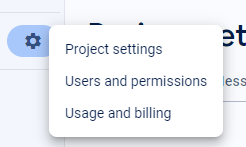

# Face Recognition

---

<p align="center">
	
</p>
<h2 align="center">
	Multiple-Face-Recognition
</h2>

---

## Prepare development environment
- C++
- Python >= 3.3
- Python extentions required:
    - **dlib~=19.24.2**
    - **[face-recognition](https://github.com/ageitgey/face_recognition "Adam Geitgey")**
    - numpy~=1.26.2
    - opencv-python~=4.5.4.60
    - cvzone~=1.6.1
    - **firebase-admin**
    - cvzone
    - datetime~=5.4
    - flask~=3.0.0
    - Pillow~=10.1.0
    - pip~=23.3.2
    - wheel~=0.42.0
    - cryptography~=41.0.7
    - Jinja2~=3.1.2
    - setuptools~=58.1.0
    - packaging~=23.2
    - zipp~=3.17.0
    - build~=1.0.3

> The project is based on a YouTube video by [Murtaza's Workshop - Robotics and AI](https://www.youtube.com/watch?v=iBomaK2ARyI "Youtube")

## Prepare Firebase Account

1. Prepare Firebase Account

[Create a Firebase account](https://support.google.com/appsheet/answer/10104995?hl=en "Google Firebase")

Install Realtime DB And Storage in Firebase

[](https://console.firebase.google.com/)

2. Generate and Download key Firebase

Go to project settings -> Service Accounts -> Generate new private key




3. Import key into Project

Rename the key file to `ServiceFirebase.json` or in each file, update the path to the Firebase key file.


4. Change the Firebase Realtime and Storage link.


Add link into `databaseURL`


Add link into `storageBucket`


## Setup

1. Install DLIB C++

**C++**

There are numerous ways to install dlib in C++, but I choose the simplest method, which is to install C++ through the Visual Studio installer and include the Desktop development with C++.

[](https://visualstudio.microsoft.com/)

**DLIB**

```shell
pip install dlib
```

2. Install Requirement

```shell
pip install -r requirements.txt
```

## Run
> If the image is not processed, run the "ProcessImage" file.
```shell
py ./src/data preprocessing/ProcessImage.py
```

1. Add data from file `data_train.json` to Realtime DB Firebase

```shell
py ./src/data preprocessing/AddDataToDB.py
```

2. Add images from `Images/processed` to Storage Firebase

```shell
py ./src/data preprocessing/AddImageToStorage.py
```

3. Encode Images From `Images/processed` into file `FinalEncode`

```shell
py ./src/data preprocessing/EncodeGenerator.py
```
4. Start Main

```shell
py ./src/main.py
```

Now Open http://127.0.0.1:5000/ in your browser.

## Contributor

<p align="justify">

Thanks goes to these wonderful people ([emoji key](https://allcontributors.org/docs/en/emoji-key))

</p>

<div align="center">
	<table>
		<tr>
			<td align="center" valign="top">
					
	        <br>
	        <a href="https://github.com/ntd1683">Tan Dung</a>
	        <p>
	          <a href="https://github.com/ntd1683/Multiple-Face-Recoginition/commits?author=foxminchan" title="Developer">💻</a>
	          <a href="#docs" title="Documentation">📖</a>
	          <a href="#infra" title="Infrastructure">🚇</a>
	        </p>
			</td>
			<td align="center" valign="top">
					
	        <br>
	        <a href="https://github.com/huynguyenjv">Huy Nguyen</a>
	        <p>
	          <a href="https://github.com/ntd1683/Multiple-Face-Recoginition/commits?author=baohuy2k3" title="Developer">💻</a>
						<a href="#data" title="Data">🔣</a>
						<a href="#research" title="Research">🔬</a>
	        </p>
			</td>
			<td align="center" valign="top">
					
	        <br>
	        <a href="https://github.com/Asa-Nguyen">Nguyen Hung</a>
	        <p>
	          <a href="https://github.com/ntd1683/Multiple-Face-Recoginition/commits?author=NguyenTriBaoThang" title="Developer">💻</a>
						<a href="#design" title="Design">🎨</a>
						<a href="#test" title="Test">🧪</a>
						<a href="#userTesting" title="User Testing">📓</a>
	        </p>
			</td>
		</tr>
	</table>
</div>

## Support and Organization

<p align="center">
	<a href="https://hutech.edu.vn/" target="_blank">
		
	</a>
</p>

## License

<p align="justify">

This project is licensed under the terms of the [MIT](LICENSE) license.

</p>
